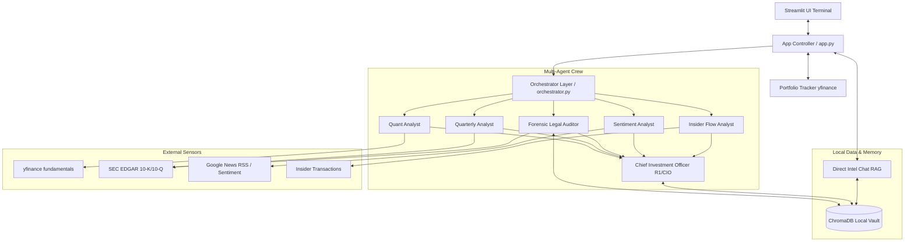

# 📊 ASYMMETRIC INTELLIGENCE TERMINAL
### *Automated Due Diligence & Live Portfolio Analytics Hub*

[](https://www.python.org/)
[](https://streamlit.io/)
[-0055ff.svg)](https://github.com/chroma-core/chroma)
[](LICENSE)

An institutional-grade, privacy-first financial analysis terminal. It integrates live multi-asset portfolio tracking, geographic asset exposure, automated due diligence reports, and a multi-agent hybrid reasoning workflow utilizing state-of-the-art LLMs (DeepSeek-R1, OpenAI, Claude).

---

## 🏛️ System Architecture

The terminal operates as a self-contained local workspace, leveraging local embeddings and a vector database for semantic search, while calling LLM providers via user-supplied API keys.



---

## ⚡ Core Features

*   **Bloomberg-Style Terminal UI**: Custom dark-mode interface utilizing modern editorial typography (`Space Grotesk`), glassmorphism tabs, interactive Echarts radar charts for risk telemetry, and Plotly historical price candlesticks.
*   **Universal LLM Orchestration**: Supports **DeepSeek** (V3/R1), **OpenAI** (gpt-4o/mini), **Anthropic Claude** (Haiku/Sonnet), and **Custom models** (via local Ollama or Groq). Configurable dynamically in the sidebar.
*   **Hybrid Reasoning Architecture**: 
    *   *Analysts (Steps 1-5)*: Execute fast, structured data extraction using cost-efficient models (e.g. DeepSeek-V3, GPT-4o-mini).
    *   *CIO (Step 6)*: Executes deep reasoning, risk correlation, and strategic synthesis using high-reasoning models (e.g. DeepSeek-R1, GPT-4o) to output the final investment verdict.
*   **100% Free Sentiment & Search Fallbacks**: Built-in Google News RSS query parser and `yfinance` news scraper, eliminating the need for paid external web search keys (Brave API-free).
*   **Robust SEC Fallbacks**: Downloads 10-K and 10-Q filings directly. Automatically falls back to Google News RSS search queries if the ticker is non-US or blocked by CIK mapping.
*   **Embedded Local RAG (SuperMemory)**: Integrates **ChromaDB** with offline sentence-transformers embeddings. Automatically indexes every completed due diligence report.
*   **Direct Intel Chat (RAG-Connected)**: The chat interface dynamically queries the local ChromaDB database using semantic similarity, allowing you to ask questions about your saved reports and historical research.
*   **Asset exposure analytics**: Live portfolio tracker (`portfolio.json`) displaying allocation metrics, P&L, and interactive world heatmaps showing exposure by country (correctly handling ETFs and global indices).

---

## 📂 Project Directory Structure

```text
├── app.py                 # Streamlit UI, RAG Chat, and Interactive Charts
├── orchestrator.py        # CrewAI Multi-Agent Pipeline and LLM Resolver
├── sensors.py             # Quantitative, Legal, Quarterly, Sentiment, and Insider Sensors
├── mcp_bridge.py          # Google News RSS Parser & yfinance Scrapers (Key-free search)
├── supermemory.py         # Local Vector Database (ChromaDB + Local Embeddings)
├── requirements.txt       # Project Dependencies
├── .gitignore             # Strict privacy git-exclusion paths
└── .env.example           # Configuration Template
```

---

## 🚀 Installation & Local Setup

### 1. Prerequisites
- **Python 3.10** or higher installed.
- Git installed.

### 2. Clone the Repository
```bash
git clone https://github.com/k6vvk7jssx-png/multy-agent-hedge-found-terminal-.git
cd multy-agent-hedge-found-terminal-
```

### 3. Virtual Environment Setup
Initialize and activate a virtual environment to isolate project packages:
```bash
# Create
python -m venv .venv312

# Activate (Windows PowerShell)
.venv312\Scripts\Activate.ps1

# Activate (Windows CMD)
.venv312\Scripts\activate.bat

# Activate (macOS/Linux)
source .venv312/bin/activate
```

### 4. Install Dependencies
```bash
pip install -r requirements.txt
```

---

## 🔑 Configuration & Environment Setup

1. Copy the environment template to create your local `.env` file:
   ```bash
   copy .env.example .env
   ```
2. Open the `.env` file and input your keys:
   ```env
   # Core API Keys (configure your preferred model)
   DEEPSEEK_API_KEY=your_deepseek_api_key
   OPENAI_API_KEY=your_openai_api_key
   ANTHROPIC_API_KEY=your_anthropic_api_key
   ```
   *(Note: The `.env` file is listed in `.gitignore` and is never committed to GitHub, protecting your keys).*

---

## 🏃 Run the Application

Start the Streamlit local dev server:
```bash
streamlit run app.py
```
Open your web browser and navigate to the local URL provided (typically **[http://localhost:8501](http://localhost:8501)**).

---

## 🛡️ Security, Privacy & Data Isolation

*   **Local Data Preservation**: All financial portfolios (`portfolio.json`) and database logs (`.log`) are stored locally on your machine and are ignored by Git.
*   **Local Vector DB**: Your ChromaDB files (`./chroma_db`) containing historical due diligence reports are stored 100% locally.
*   **Web Deployment Security**: When deploying this app to cloud services (like Streamlit Community Cloud), do **not** upload the `.env` file. Input the keys inside the platform's secure **Secrets Manager** dashboard. Users will also be prompted to securely type their keys in the sidebar (keys are kept in memory and never written to disk).

---

## ⚖️ Disclaimer

*This terminal is for informational and educational purposes only. It does not constitute financial, legal, or investment advice. Always perform your own due diligence before allocating capital.*
